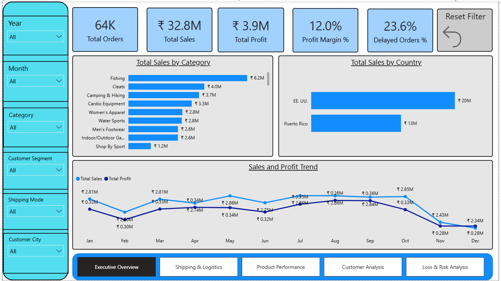
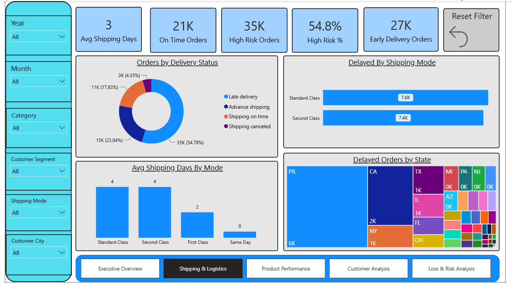
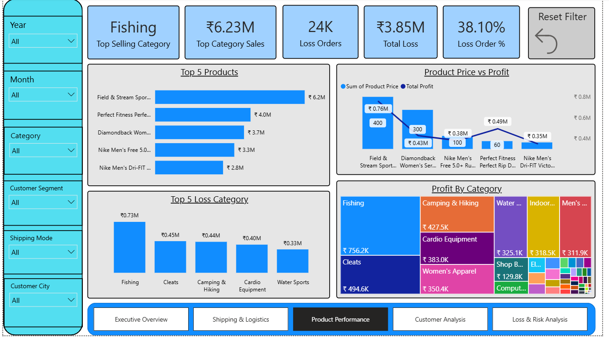
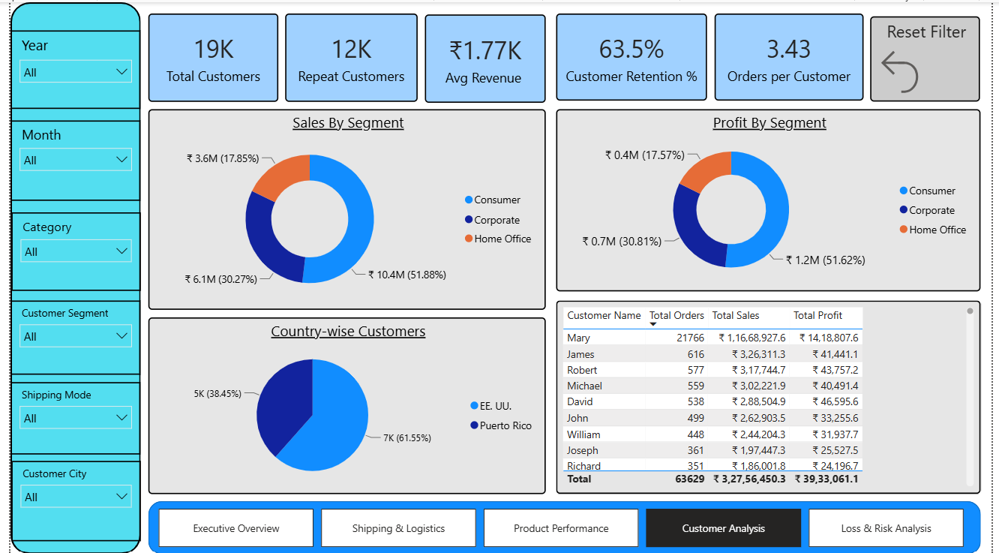
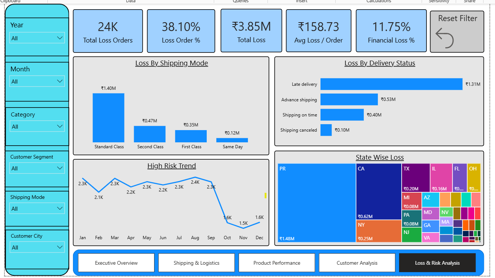

# 📦 Supply Chain Analytics Dashboard

This project is an end-to-end Supply Chain Analytics Dashboard built in Power BI using the DataCo Supply Chain dataset. The goal of this project was to analyze sales, profit, delivery performance, customer behavior, and operational risks to generate meaningful business insights and support decision-making.

## Short Description

Managing a supply chain involves balancing sales performance, customer satisfaction, delivery efficiency, and profitability. This dashboard brings all these areas together in a single report, making it easier to identify trends, monitor KPIs, and uncover areas that need improvement.

## Tech Stack

The dashboard was built using the following tools and technologies:

* **Power BI Desktop** – Used to create the interactive dashboard and reports.
* **Power Query** – Used for data cleaning and transformation.
* **Python** – Used for preprocessing the dataset and creating business-related columns such as Delivery Delay and Profit Margin.
* **DAX (Data Analysis Expressions)** – Used for KPI calculations and dynamic measures.
* **Data Modeling** – A star schema model was created using fact and dimension tables to improve performance and reporting.
* **PBIX File** – Used for dashboard development.

## Data Source

**Dataset:** DataCo Smart Supply Chain Dataset

The dataset contains information related to customers, products, orders, shipping, sales, profit, and delivery performance. It provides a complete view of supply chain operations and allows analysis from both operational and financial perspectives.

## Features & Highlights

### Business Problem

Supply chain data is often spread across different business functions, making it difficult to understand overall performance. Key questions such as:

* Which products generate the most sales and profit?
* How efficient are delivery operations?
* How many orders are running at a loss?
* Which customers contribute the most revenue?
* What percentage of orders are considered high risk?

can be difficult to answer without a centralized reporting solution.

### Goal of the Dashboard

The objective of this dashboard is to:

* Monitor overall business performance through key KPIs.
* Track delivery performance and shipping efficiency.
* Identify loss-making orders and operational risks.
* Analyze product and category performance.
* Understand customer purchasing behavior.
* Support data-driven decision making.

### Dashboard Walkthrough

#### 1. Executive Overview

This page provides a high-level summary of business performance.

Key KPIs:

* Total Sales
* Total Profit
* Total Orders
* Profit Margin %
* Delayed Order %

Key Visuals:

* Monthly Sales Trend
* Monthly Profit Trend
* Sales by Category
* Sales by Country

#### 2. Shipping & Logistics Analysis

This page focuses on delivery performance and logistics efficiency.

Key KPIs:

* Average Shipping Days
* High Risk Orders
* High Risk %
* On-Time Orders

Key Visuals:

* Delivery Status Breakdown
* Delayed Orders by Shipping Mode
* Average Shipping Days by Shipping Mode
* Regional Delivery Performance Analysis

#### 3. Product Performance

This page helps identify the best and worst performing products.

Key KPIs:

* Top Selling Category
* Top Category Sales
* Loss Orders
* Total Loss

Key Visuals:

* Top 10 Products by Sales
* Profit by Category
* Loss by Category
* Product Price vs Profit Analysis

#### 4. Customer Analysis

This page focuses on customer behavior and revenue contribution.

Key KPIs:

* Total Customers
* Repeat Customers
* Average Revenue per Customer
* Customer Retention %
* Order per Customer

Key Visuals:

* Sales by Customer Segment
* Profit by Customer Segment
* Top Customers
* Customer Distribution by Country

#### 5. Loss & Risk Analysis

This page highlights operational and financial risks within the supply chain.

Key KPIs:

* Total Loss
* Loss Orders
* High Risk Orders
* Loss %

Key Visuals:

* Loss by Shipping Mode
* Loss by Delivery Status
* High Risk Order Trend
* Geographic Loss Analysis

### Business Insights

Some of the key insights that can be derived from the dashboard include:

* Identification of categories and products contributing the highest revenue and profit.
* Detection of shipping methods with the highest delay rates.
* Understanding the relationship between delivery performance and profitability.
* Recognition of high-risk orders that may impact customer satisfaction.
* Identification of customers and regions contributing the most business value.
* Analysis of loss-making orders and their impact on overall performance.

## Screenshots

Add screenshots of each dashboard page here:

* Executive Overview

  
  
* Shipping & Logistics Analysis

  
  
* Product Performance

  
  
* Customer Analysis

  
  
* Loss & Risk Analysis

  

## Conclusion

This project demonstrates the complete data analytics workflow, including data cleaning, feature engineering, data modeling, DAX calculations, dashboard design, and business insight generation. It showcases how Power BI can be used to transform raw supply chain data into actionable insights that support business decisions.
